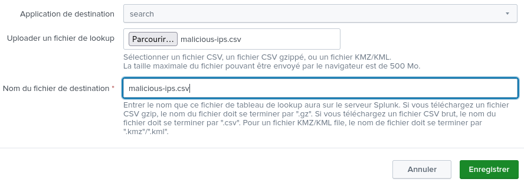

# ip-analyzer-from-splunk-query

## Prérequis

- Installer Ansible :

```bash
sudo apt-get install python3-pip python3-venv
python3 -m venv ansible-env
source ansible-env/bin/activate
pip install ansible
```

**⚠️ Dans le playbook Ansible ```auto_splunk_query.yml```, vous devez compléter les valeur des variables ```username``` et ```password``` concernant votre compte Splunk. ⚠️**

**⚠️ Dans le script Python ```ip-analyzer-from-splunk-query.py```, vous devez disposer d'une clé API [AbuseIPDB](https://www.abuseipdb.com) en crééant un compte. Puis, dans le script ```ip-analyzer-from-splunk-query.py``` vous devez compléter la valeur de la variable ```API_KEY```. ⚠️**

**⚠️ Dans le script Bash ```run-ip-analyzer-from-splunk-query.sh```,  compléter la variable globale ```PATH_TO_SOC_PROJECT``` pour correspondre à l'emplacement où se trouve le répertoire ```soc-project```. ⚠️**

## Utilisation

Exécutez ```run-ip-analyzer-from-splunk-query.sh``` : 

```bash
./run-ip-analyzer-from-splunk-query.sh
```

## Automatisation

Via le ```cronjob``` suivant (tous les jours à minuit) :

```
0 0 * * * <path-to-soc-project>/automatisation/ip-analyzer-from-splunk-query/run-ip-analyzer-from-splunk-query.sh
```

**⚠️ Dans le ```cronjob```,  compléter la variable ```<path-to-soc-project>``` pour correspondre à l'emplacement où se trouve le répertoire ```soc-project```. ⚠️**

## Ajouter/modifier ```malicious-ips.csv``` dans Splunk

Une fois le fichier ```malicious-ips.csv``` obtenu, importez ce fichier dans Splunk Enterprise en tant que **lookup table** :



Pour mettre à jour le fichier ```malicious-ips.csv```, supprimer la **lookup table** et importez le fichier de nouveau.

Dans cette même liste, des adresses IPs malveillantes ont été ajoutées de base au travers de cette liste : https://snort-org-site.s3.amazonaws.com/production/document_files/files/000/034/548/original/ip-filter.blf.
