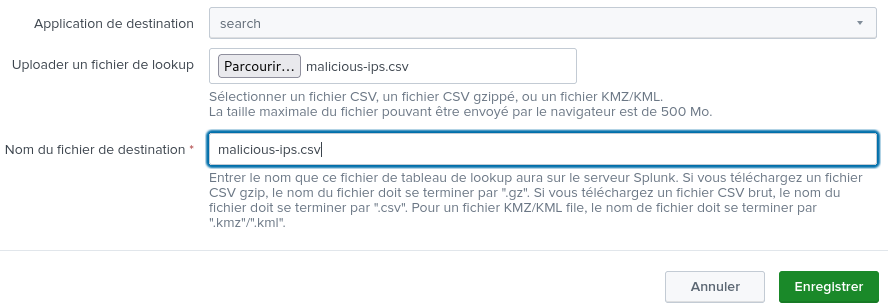

# ip-analyzer-from-splunk-request

Dépendances :

- AbuseIPDB
- Splunk Enterprise Security

Requête Splunk utilisée :

```
index="connectix" sourcetype="suricata" earliest=-24h
| stats count by dest_ip, dest_port
| where NOT cidrmatch("192.168.10.0/24", dest_ip)
| sort - count
```

Exécution :

```py
python3 ip-analyzer-from-splunk-request.py
```

Une fois le fichier ```malicious-ips.csv``` obtenu, importez ce fichier dans Splunk Enterprise en tant que **lookup table** :



Pour mettre à jour le fichier ```malicious-ips.csv```, supprimer la **lookup table** et importez le fichier de nouveau.

Dans cette même liste, des adresses IPs malveillantes ont été ajoutées de base au travers de cette liste : https://snort-org-site.s3.amazonaws.com/production/document_files/files/000/034/548/original/ip-filter.blf.